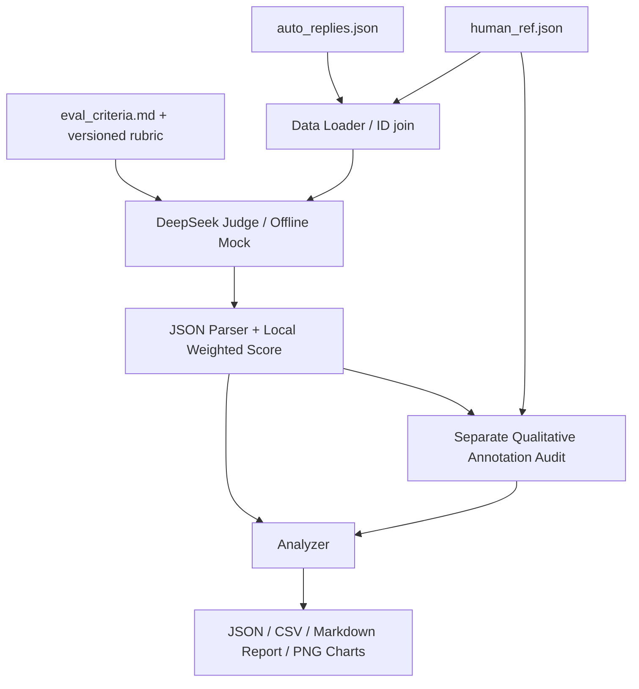

# Auto Reply Quality Evaluation Pipeline

把“准确、有用、语气好、不能瞎编”转化为可解释的客服回复评估流水线。Python 3.10+，使用 DeepSeek LLM Judge，提供完全离线的确定性 mock 模式。

**交付状态：20 条 mock 全部成功，真实 API 尚未运行（未配置 Key）。当前图表与数值仅用于展示工程流程，不代表线上质量。**

## Evaluation Design

先读数据，再设计评价体系：

- `data/auto_replies.json`：20 条数组记录，真实字段为 `id / user_question / auto_reply`。
- `data/human_ref.json`：20 条数组记录，真实字段为 `id / human_reference / annotator_notes`，与回复按 ID 关联，没有人工分数或 pass/fail 标签。
- `data/eval_criteria.md`：原始业务要求强调准确、有用、语气好、不瞎编；结果用于判断是否扩大服务覆盖。
- 三个文件从原附件原样复制，未修改数据。Loader 兼容 `task3_` 文件名、根目录、`question/reply/reference/notes` 字段别名，以及 `cases/data/items` 外层包装；拒绝重复 ID、错误类型与空必填字段，报告缺失或孤立参考。

原建议四项指标缺少对“语气好”和主动协助的直接测量。结合业务原文与人工分析，本项目增加 `service`，并将完整性明确为“完整性与可操作性”。

| 指标 | 含义 | 评分 | 权重 | 选择理由 |
|---|---|---|---:|---|
| Correctness | 正确性与事实依据，避免捏造政策、参数、状态及承诺 | 0–5 | 30% | 错误信息和虚构承诺的业务风险最高，保留最高单项权重 |
| Relevance | 回应用户实际诉求和多意图问题 | 0–5 | 15% | 避免答非所问和无关模板内容 |
| Completeness | 必要信息、有效追问、可执行下一步 | 0–5 | 25% | 衡量回复能否推动问题解决 |
| Clarity | 清晰、简洁、专业、无歧义 | 0–5 | 10% | 降低理解和操作成本 |
| Service | 同理心、主动协助、合理承担跟进责任 | 0–5 | 20% | 对应“语气好”，补充人工分析反复指出的操作负担与服务意识 |

每个指标在 `src/config.py` 有独立的 **0、1、2、3、4、5 六档锚点**；代码、Prompt、统计和报告共享这一配置。例如完整性 5 分要求必要信息齐全且下一步明确，3 分表示遗漏重要信息，0 分表示没有有用信息。

```text
overall_score = correctness × 0.30 + relevance × 0.15
              + completeness × 0.25 + clarity × 0.10 + service × 0.20
score_100 = overall_score × 20
```

这是业务假设而非唯一正确权重；未根据样本得分或验证结果调参。完整性考察“有没有必要信息和行动路径”，服务考察“如何回应情绪并承担协助责任”，Prompt 明确要求避免机械重复扣分。总分不能替代对严重事实错误的单独复核。

## Architecture



```text
data/               原始输入副本
src/config.py       指标、权重、环境配置、局限性
src/data_loader.py  字段验证与 ID 关联
src/evaluator.py    DeepSeek 请求、Prompt、重试
src/mock_evaluator.py  确定性演示规则
src/parser.py       JSON 恢复、数值校验与本地计分
src/validator.py    人工文字分析的定性对比
src/analyzer.py     统计、分布、最低三条
src/visualizer.py   无界面 PNG 图表
src/reporter.py     JSON / CSV / Markdown
tests/              离线单元与流水线异常测试
main.py             CLI 编排
```

## Evaluation Method

**LLM-as-a-Judge**：每条发送用户问题、自动回复、人工参考、业务原文、完整量表；不发送 `annotator_notes`。参考只是辅助证据，允许不同措辞；不通过字符串相似度打分。输入内容均当作数据处理，防止回复中的指令改变评分任务。

参考可能含未知事实：case_13 有 `XX` 占位符，case_15 含 50 元补偿承诺。Judge 不能据此要求自动回复作相同承诺，也不能声称已查询实际订单。缺少事实证据和已证实错误需要区分。自助路径本身不是错误，合理追问也不等于不完整。

**Structured Output**：使用 OpenAI-compatible SDK、`response_format={"type":"json_object"}`、`temperature=0`，各项必须包含数值与中文理由，另含主要问题与改进建议。实现依据 [DeepSeek 官方 JSON Output 文档](https://api-docs.deepseek.com/guides/json_mode/)。模型名称可通过环境变量调整。

- 恢复自然语言或 code fence 内的单个 JSON 对象；拒绝多个对象歧义。
- 数字字符串转换，有限数值裁剪到 0–5，转换及裁剪写入 `warnings`。
- 拒绝布尔、空值、NaN、Infinity、缺少指标或理由；格式错误重新请求，不自行猜造缺失评分。
- 总分只在本地计算，忽略模型给出的总分。
- 请求超时 60 秒，每次请求最多 3 次总尝试，退避 1/2 秒；SDK 内置重试关闭，避免叠加。对 429、5xx、超时及 JSON 错误重试；401、403 等永久错误不重试。
- 单条失败记录 `error`，分数为 `null`，后续样本继续；失败不计入均分，也不当成低质量零分。
- 每条保存 checkpoint；它用于故障排查，目前不支持自动续跑。日志不打印 Key 或完整供应商错误体。
- 保存输入、Prompt 哈希、rubric、模型配置、实际响应模型、每次响应 token usage 与尝试次数，方便追踪；哈希不等于跨模型版本完全可复现。

**Human Reference Validation**：人工只有文字分析，不能合法计算 Pearson/Spearman/MAE/F1。API 模式在评分之后单独请求审计，返回 `agree / partial / disagree / uncertain`，说明一致或分歧原因，引用人工分析与回复原文，记录人工标注疑点。代码检验引文必须逐字出现在相应来源，避免审计凭空编证据。

例如 case_08 已明确回答 TPU，人工分析的“正确但没用”值得复核；case_05、case_17 的原回复也包含一定的主动协助表达。审计应回到原文，允许质疑双方。审计输出不是人工真值；报告展示类别数量与审计覆盖率，**不把一致数量叫准确率**。同模型自审和同数据参考仍有偏差，真正的效度验证需要独立人工复核集。

**Mock**：只使用回复长度、追问/协助/安抚词、预定义流程冲突及风险短语等透明规则；不调用 API，不按 ID 查表，不读取人工分析生成分数，不使用随机数。规则未发现错误不代表事实正确。mock 不具备语义审计能力，因此人工比较诚实标为 `not_assessed`，附上真实参考和分析供复核。第三张图展示 0/20 已审计，而非编造一致率。

API 正常运行时每个 case 需一次评分和一次审计：20 条约 40 次请求，重试会增加次数。所有请求均在本地循环逐条发起。

## Quick Start

Python 3.10+；建议建立虚拟环境。

```bash
python -m venv .venv
# Windows PowerShell: .\.venv\Scripts\Activate.ps1
# Linux/macOS: source .venv/bin/activate
pip install -r requirements.txt
python main.py --mode mock
pytest -q
```

无需 Key 即可完成 mock 全流程。激活脚本受限制时，Windows 可以直接使用 `.\.venv\Scripts\python.exe main.py --mode mock` 和 `.\.venv\Scripts\python.exe -m pytest -q`。

配置真实 API（仅在 `.env` 尚不存在时复制，避免覆盖已有 Key）：

```bash
cp .env.example .env
# PowerShell: Copy-Item .env.example .env
```

```dotenv
DEEPSEEK_API_KEY=your_api_key_here
DEEPSEEK_BASE_URL=https://api.deepseek.com
DEEPSEEK_MODEL=deepseek-chat
```

编辑 `.env` 后运行：

```bash
python main.py --mode api --limit 3 --output-dir outputs/api_smoke
python main.py --mode api
```

Key 只从环境变量或项目 `.env` 读取，系统变量优先；`.env` 被 Git 忽略，`.env.example` 不含秘密。源码和报告不保存 Key。无 Key 时清晰提示并以状态码 2 退出，且不覆盖已有结果。

支持 `--data-dir data`、`--output-dir outputs`。默认路径相对于项目所在位置，显式相对路径相对于运行目录。`--limit` 必须为正整数，按源文件顺序取前 N 条。退出码：0 完成；1 有评分或审计失败（报告仍保存）；2 配置或输入错误。

每次运行会更新所选输出目录的同名文件；建议用不同 `--output-dir` 保留不同模式或版本的实验。

## Results

以下为本项目实际执行 `python main.py --mode mock` 的结果，**不是 DeepSeek 实测**。后续运行后的最新事实以 `outputs/run_metadata.json` 和 `outputs/report.md` 为准；本节是提交时的 mock 快照。

| 统计 | 实测值 |
|---|---:|
| 成功 / 总数 | 20 / 20 |
| 平均总分 | 3.2125 / 5 |
| 中位数 | 3.075 / 5 |
| 百分制均分 | 64.25 |
| 最高 / 最低 | 4.05 / 2.55 |
| Correctness / Relevance | 3.80 / 3.60 |
| Completeness / Clarity / Service | 2.55 / 4.85 / 2.05 |
| 最低三条 | case_11：2.55；case_19：2.70；case_01：2.85 |
| 定性审计 | 0/20 已审计，20 条保留人工分析待复核 |

case_01 与 case_13 同为 2.85 分，最低三条使用 ID 升序确定同分顺序。规则识别到 case_11 的流程混用、case_19 的提醒承诺风险，但不应将规则命中当成已证实业务事实。逐项解释及改进建议见 [自动报告](outputs/report.md)。


产物：

| 文件 | 内容 |
|---|---|
| `evaluation_results.json` | 全部逐条分数、理由、错误、模式与输入哈希 |
| `evaluation_results.csv` | 展平的得分及理由；UTF-8 BOM 便于 Excel 打开 |
| `summary.json` | 成功/失败数量、均分、中位数、各项分布、最低三条 |
| `validation_results.json` | 人工原始参考、分析、审计结论、引用及分歧 |
| `run_metadata.json` | 运行来源、指标配置、数据及 Prompt 哈希 |
| `report.md` | 概览、指标、图表、最差分析、人工对比、局限与改进 |
| 三张 PNG | 英文标题避免中文字体依赖，160 dpi 可直接截图 |
| `checkpoint.json` | 逐条保存的中间结果，Git 忽略 |

## Tests

测试覆盖 JSON 包装与损坏响应、数值转换与边界、权重、排序、真实字段关联、确定性 mock、人工引用校验、API 重试及错误脱敏、单条/全部失败产物、无 Key 退出。测试不请求真实 DeepSeek。

实测 **29 项通过**，包含真实 OpenAI SDK 配合离线 HTTP transport 的请求序列化、评分响应解析和后续审计链路。验证环境为 Python 3.11.7、openai 2.54.0、pandas 2.1.4、matplotlib 3.8.0、numpy 1.26.4；运行产物也记录相关依赖版本。

```bash
pytest -q
```

## Limitations

- **Judge 偏差**：模型版本、Prompt、temperature、评价顺序均影响分数；低温仍不完全确定。可重复评估取均值、增加多 Judge 投票。
- **答案非唯一**：只评价语义和事实，不能以参考文本相似度替代质量判断。
- **外部事实缺失**：没有企业商品、政策或订单库，部分参考也不完整；应通过知识库/RAG 对具体 claim 提供证据。
- **权重主观**：当前体现客服风险和服务意识，并非校准后的最优权重；应结合满意度、投诉率和人工质检校准，检查维度间重复计分。
- **样本小**：20 条不能代表线上流量；需扩大数据、分层抽样并建立 regression evaluation dataset。
- **验证有限**：人工文字分析存在争议，没有独立量化标签；同批参考和同模型审计不能证明评分方法可靠。mock 的 0 审计覆盖不是验证失败率，也不是质量结论。
- **工程范围**：串行、无数据库、无自动续跑；未配置 Key，真实 DeepSeek 连通性、账号可用模型和返回质量尚未验证。

## Future Improvements

优先收集双人独立评分与裁决标签，建立保留测试集；再计算相关性、误差或分类指标。补齐企业知识库和服务工具能力证据，开展 Multi-Judge、多次评估稳定性实验。加入按问题类型分层的回归评测、CI、线上抽样与结果漂移监测。事实错误的业务阻断规则应由业务确认后校准。

## AI Tools Usage

本项目开发过程中使用 Codex 辅助项目结构设计、Python 代码实现、Prompt 调整、README 整理、测试与代码检查。实际运行结果来自本地执行，未虚构 DeepSeek 分数。

**人工检查状态：待提交者完成。** 指标设计、评价逻辑、运行结果和错误分析已经经过自动测试及 Codex 检查，但不能据此声称“经过人工检查”。提交前请亲自核对业务权重、参考疑点、最差样本理由与运行来源，完成后再如实记录人工检查结论。
