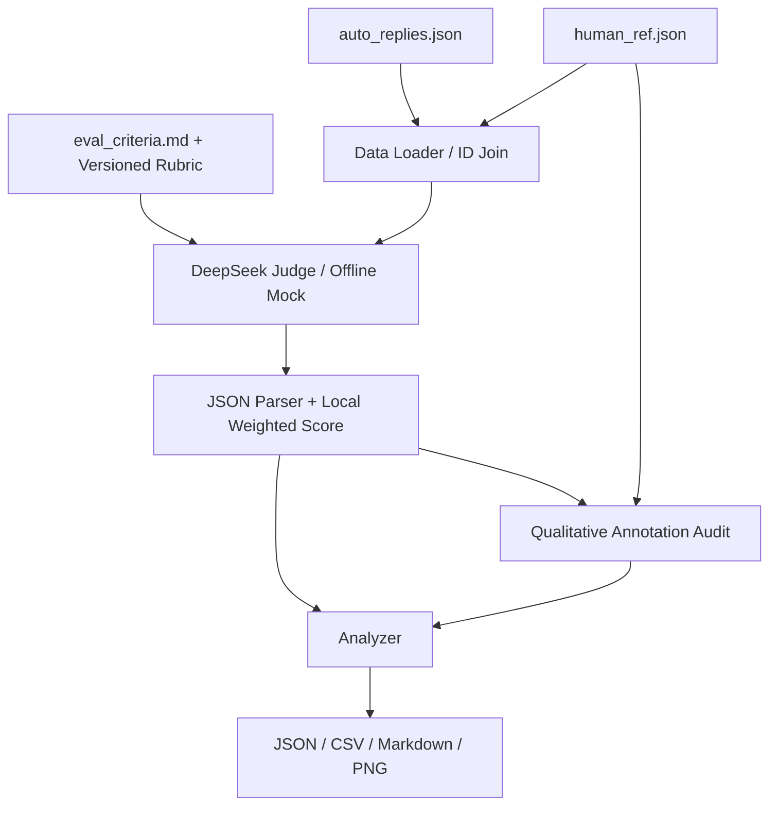

# Auto Reply Quality Evaluation Pipeline

将业务方模糊的“准确、有用、语气好、不能瞎编”等客服质量要求，转化为一套可量化、可执行、可解释、可验证的自动回复质量评估流水线。

项目基于 Python 3.10+ 实现，使用 DeepSeek API 作为 LLM-as-a-Judge，同时提供完全离线、确定性的 Mock 模式，用于开发、测试和流水线演示。

**最终交付状态：已完成真实 DeepSeek API 评估。20 条样本全部评分成功，失败 0 条；20/20 完成人工文字标注定性审计，20/20 完成审计证据来源核验。最终结果及图表均来自 API 模式实际运行。**

---

## 1. Evaluation Design

### 1.1 数据说明

项目首先读取真实附件，再根据业务要求设计评价体系。

- `data/auto_replies.json`
  - 共 20 条自动回复
  - 主要字段：`id / user_question / auto_reply`

- `data/human_ref.json`
  - 共 20 条人工参考
  - 主要字段：`id / human_reference / annotator_notes`
  - 与自动回复通过 ID 关联
  - 不包含人工数值分数或 pass/fail 标签

- `data/eval_criteria.md`
  - 业务方原始评价要求
  - 主要强调：准确、有用、语气好、不瞎编

三个文件均从原始附件复制，未修改原始数据。

Data Loader 同时支持：

- 根目录或 `data/` 目录
- 部分字段别名
- `cases / data / items` 等外层包装
- 重复 ID 检查
- 必填字段检查
- 数据类型检查
- 缺失参考或孤立参考提示

---

### 1.2 从模糊业务要求到可量化指标

原始要求中的“准确、有用、语气好、不能瞎编”无法直接用于自动评分，因此将其拆解为 5 个独立维度。

| 指标 | 含义 | 评分 | 权重 | 选择理由 |
|---|---|---:|---:|---|
| Correctness | 正确性与事实依据，避免捏造政策、参数、状态及承诺 | 0–5 | 30% | 错误事实和虚构承诺业务风险最高 |
| Relevance | 是否真正回应用户当前实际诉求 | 0–5 | 15% | 避免答非所问和模板化回复 |
| Completeness | 必要信息、有效追问及可执行下一步 | 0–5 | 25% | 衡量回复能否真正推动问题解决 |
| Clarity | 清晰、简洁、专业、无歧义 | 0–5 | 10% | 降低用户理解和操作成本 |
| Service | 同理心、主动协助及合理承担跟进责任 | 0–5 | 20% | 对应“语气好”和客服服务意识 |

每个指标均在 `src/config.py` 中定义完整的 **0 / 1 / 2 / 3 / 4 / 5 六档评分锚点**。

例如：

- Completeness = 5：必要信息完整，下一步明确且可执行
- Completeness = 3：基本可用，但遗漏重要信息或下一步不够具体
- Completeness = 0：没有提供有用信息

---

### 1.3 总分计算

总分不由 LLM 直接给出，而是在本地按照固定权重计算：

```text
overall_score =
    correctness × 0.30
  + relevance × 0.15
  + completeness × 0.25
  + clarity × 0.10
  + service × 0.20

score_100 = overall_score × 20
```

最终总分范围：

```text
0 ~ 5
```

同时提供百分制结果：

```text
0 ~ 100
```

当前权重属于业务假设，并非唯一正确答案。

项目没有根据最终样本得分反向调整权重，避免为了得到“好看结果”而人为调参。

此外：

- Completeness 关注“有没有必要信息和行动路径”
- Service 关注“如何回应用户情绪并承担合理协助责任”
- Relevance 关注“是否真正回应当前诉求”
- Correctness 关注“事实和承诺是否可靠”

Prompt 明确要求避免因为同一个缺陷在多个维度中机械重复扣分。

---

## 2. Architecture



项目主要结构：

```text
auto-reply-evaluator/
│
├── data/
│   ├── auto_replies.json
│   ├── human_ref.json
│   └── eval_criteria.md
│
├── src/
│   ├── config.py
│   ├── data_loader.py
│   ├── evaluator.py
│   ├── mock_evaluator.py
│   ├── parser.py
│   ├── validator.py
│   ├── analyzer.py
│   ├── visualizer.py
│   └── reporter.py
│
├── tests/
│
├── outputs/
│
├── screenshots/
│
├── main.py
├── requirements.txt
├── .env.example
├── .gitignore
└── README.md
```

模块职责：

```text
src/config.py
指标、权重、环境配置、Rubric 与局限性

src/data_loader.py
字段校验、数据读取与 ID 关联

src/evaluator.py
DeepSeek 请求、Judge Prompt、重试与调用追踪

src/mock_evaluator.py
确定性离线演示规则

src/parser.py
JSON 恢复、数值校验、本地加权计分

src/validator.py
人工文字分析的定性一致性审计与证据核验

src/analyzer.py
整体统计、指标分布、最低三条

src/visualizer.py
生成 PNG 图表

src/reporter.py
生成 JSON / CSV / Markdown 报告

main.py
CLI 编排入口
```

---

## 3. Evaluation Method

### 3.1 LLM-as-a-Judge

API 模式使用 DeepSeek 作为 LLM Judge。

每条请求输入：

- 用户问题
- 自动回复
- 人工参考回复
- 原始业务要求
- 完整 Rubric
- 每个指标的评分锚点

评分阶段**不读取 `annotator_notes`**，避免将人工分析直接泄漏给 Judge。

Judge 被要求：

- 独立评价每个指标
- 不使用文本相似度作为质量判断
- 不因措辞不同而扣分
- 区分事实错误和证据不足
- 避免无依据地全部给高分
- 不为了制造分布而故意压低得分
- 不虚构订单状态、商品参数、系统能力或执行结果

---

### 3.2 Human Reference 的使用方式

`human_reference` 是高价值参考，但不是绝对企业事实库。

例如：

- case_13 中存在 `XX` 占位符
- case_15 中存在具体补偿金额
- 部分参考回复声称可以查订单、联系物流或设置提醒

这些内容不能因为出现在人工参考中，就自动视为企业真实能力。

项目采用以下原则：

```text
与已有证据冲突
→ Correctness 明显扣分

完全无证据支持
→ 根据风险适度扣分

与人工参考一致但未独立验证
→ 不按照事实错误处理
```

以下信息仍需要特别谨慎：

- `XX` 等占位符
- 具体补偿金额
- 实时订单 / 物流 / 库存状态
- 已经执行退款、换货、设置提醒等操作
- 未提供依据的系统能力或权限

---

## 4. Rubric Calibration

在初版运行中发现，LLM Judge 存在两个值得校准的问题。

### 4.1 Topic Relevance 与 Intent Relevance

最初 Judge 容易把：

```text
回复仍然围绕相同主题
```

直接判断为：

```text
高相关性
```

但客服场景中：

> 主题相关不代表真正回应了用户当前实际诉求。

例如：

```text
用户：退货流程我搞了半天还是不会操作
```

如果自动回复只是再次重复标准退货流程：

```text
申请退款 → 填写原因 → 寄回商品
```

虽然仍然属于“退货”主题，但没有解决用户真正的问题：

```text
我具体卡在哪一步，该怎么办？
```

因此在 Relevance 中进一步区分：

- **Topic Relevance**
- **Intent Relevance**

如果回复只重复用户已经明确表示无效或无法理解的信息，不应获得较高的 Relevance 分数。

---

### 4.2 避免跨指标重复扣分

初版中还发现：

```text
缺少订单号追问
```

可能同时导致：

```text
Correctness -1
Relevance -1
Completeness -1
Service -1
```

这会造成同一个缺陷被重复惩罚。

最终 Prompt 明确划分：

- `Correctness`
  - 事实、政策、数字、承诺是否可靠

- `Relevance`
  - 是否真正回应用户当前实际诉求

- `Completeness`
  - 信息、条件、步骤、限制和下一步是否完整

- `Clarity`
  - 表达是否清晰专业

- `Service`
  - 同理心、主动协助和合理服务意识

例如：

> “没有询问订单号”

通常主要影响：

```text
Completeness
Service
```

不应在没有事实错误的情况下继续降低 Correctness。

---

### 4.3 Sanity Check

校准后使用不同质量样本进行人工 sanity check。

最终代表性结果：

```text
case_14 = 4.25
case_18 = 3.75
case_20 = 3.50
```

人工分析分别对应：

```text
case_14：处理得较好，但可以更加主动
case_18：基本正确，整体质量尚可
case_20：没有真正回应用户操作困难
```

说明 Judge 已能够区分：

```text
处理较好
>
整体尚可
>
未真正回应实际诉求
```

Prompt 在此后冻结，不再根据单个 case 继续调参，避免过拟合当前 20 条数据。

---

## 5. Structured Output

使用 OpenAI-compatible SDK 调用 DeepSeek：

```python
response_format={"type": "json_object"}
temperature=0
```

单条返回结构示例：

```json
{
  "correctness": {
    "score": 4,
    "reason": "核心信息基本正确，但部分事实仍缺少独立业务依据"
  },
  "relevance": {
    "score": 5,
    "reason": "直接回应了用户当前问题"
  },
  "completeness": {
    "score": 3,
    "reason": "缺少进一步追问和明确下一步"
  },
  "clarity": {
    "score": 5,
    "reason": "语言清晰简洁"
  },
  "service": {
    "score": 3,
    "reason": "语气礼貌，但主动协助不足"
  },
  "overall_reason": "整体方向正确，但操作闭环不足",
  "improvement": "增加必要追问并给出明确下一步"
}
```

程序负责：

- 从自然语言或 code fence 中恢复单个 JSON 对象
- 拒绝多个 JSON 对象导致的歧义
- 将数字字符串转换为数值
- 检查 NaN / Infinity
- 将分数限制到 0～5
- 缺失指标或理由时重新请求
- 不自行猜造缺失结果
- 总分统一在本地计算

---

## 6. API Robustness

每次请求：

- timeout：60 秒
- 最多 3 次总尝试
- SDK 内置重试关闭
- 自定义退避：1 秒 / 2 秒
- 429、5xx、超时及结构错误允许重试
- 401、403 等永久错误不重复请求

单条失败不会终止整个评估。

失败样本保存：

```text
error
overall_score = null
score_100 = null
```

失败 case：

- 不计入均分
- 不按 0 分处理
- 后续样本继续执行

每处理完一条 case 都会更新：

```text
outputs/checkpoint.json
```

目前 checkpoint 用于：

- 调试
- 故障排查
- 查看中间结果

暂
