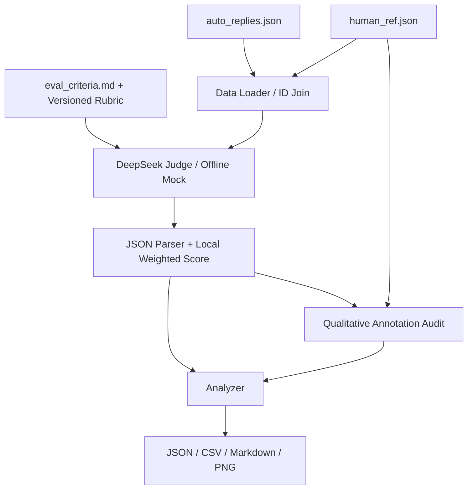
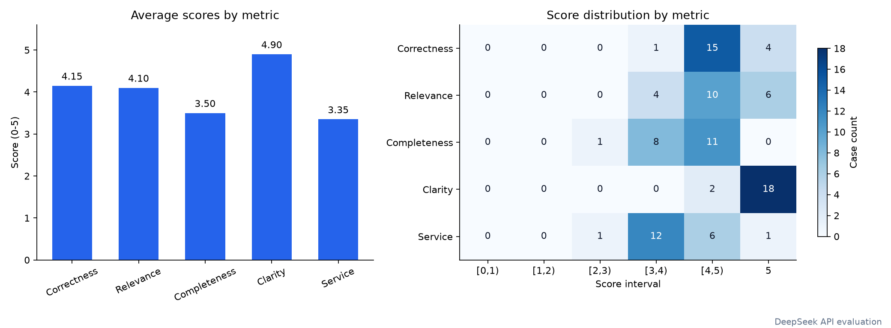
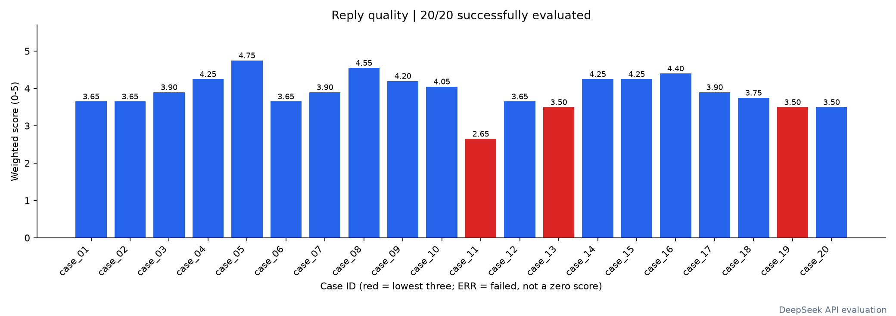
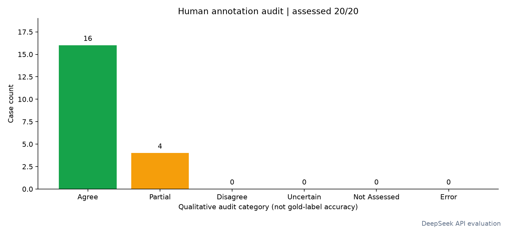

# Auto Reply Quality Evaluation Pipeline

将业务方模糊的“准确、有用、语气好、不能瞎编”等客服质量要求，转化为一套可量化、可执行、可解释、可验证的自动回复质量评估流水线。

项目基于 Python 3.10+ 实现，使用 DeepSeek API 作为 LLM-as-a-Judge，同时提供完全离线、确定性的 Mock 模式，用于开发、测试和流水线演示。

**最终交付状态：已完成真实 DeepSeek API 评估。20 条样本全部评分成功，失败 0 条；20/20 完成人工文字标注定性审计，20/20 完成审计证据来源核验。最终结果及图表均来自 API 模式实际运行。**

---

## 1. Evaluation Design

### 1.1 数据说明

项目首先读取真实附件，再根据业务要求设计评价体系。

- `data/auto_replies.json`
  - 共 20 条自动回复
  - 主要字段：`id / user_question / auto_reply`

- `data/human_ref.json`
  - 共 20 条人工参考
  - 主要字段：`id / human_reference / annotator_notes`
  - 与自动回复通过 ID 关联
  - 不包含人工数值分数或 pass/fail 标签

- `data/eval_criteria.md`
  - 业务方原始评价要求
  - 主要强调：准确、有用、语气好、不瞎编

三个文件均从原始附件复制，未修改原始数据。

Data Loader 同时支持：

- 根目录或 `data/` 目录
- 部分字段别名
- `cases / data / items` 等外层包装
- 重复 ID 检查
- 必填字段检查
- 数据类型检查
- 缺失参考或孤立参考提示

---

### 1.2 从模糊业务要求到可量化指标

原始要求中的“准确、有用、语气好、不能瞎编”无法直接用于自动评分，因此将其拆解为 5 个独立维度。

| 指标 | 含义 | 评分 | 权重 | 选择理由 |
|---|---|---:|---:|---|
| Correctness | 正确性与事实依据，避免捏造政策、参数、状态及承诺 | 0–5 | 30% | 错误事实和虚构承诺业务风险最高 |
| Relevance | 是否真正回应用户当前实际诉求 | 0–5 | 15% | 避免答非所问和模板化回复 |
| Completeness | 必要信息、有效追问及可执行下一步 | 0–5 | 25% | 衡量回复能否真正推动问题解决 |
| Clarity | 清晰、简洁、专业、无歧义 | 0–5 | 10% | 降低用户理解和操作成本 |
| Service | 同理心、主动协助及合理承担跟进责任 | 0–5 | 20% | 对应“语气好”和客服服务意识 |

每个指标均在 `src/config.py` 中定义完整的 **0 / 1 / 2 / 3 / 4 / 5 六档评分锚点**。

例如：

- Completeness = 5：必要信息完整，下一步明确且可执行
- Completeness = 3：基本可用，但遗漏重要信息或下一步不够具体
- Completeness = 0：没有提供有用信息

---

### 1.3 总分计算

总分不由 LLM 直接给出，而是在本地按照固定权重计算：

```text
overall_score =
    correctness × 0.30
  + relevance × 0.15
  + completeness × 0.25
  + clarity × 0.10
  + service × 0.20

score_100 = overall_score × 20
```

最终总分范围：

```text
0 ~ 5
```

同时提供百分制结果：

```text
0 ~ 100
```

当前权重属于业务假设，并非唯一正确答案。

项目没有根据最终样本得分反向调整权重，避免为了得到“好看结果”而人为调参。

此外：

- Completeness 关注“有没有必要信息和行动路径”
- Service 关注“如何回应用户情绪并承担合理协助责任”
- Relevance 关注“是否真正回应当前诉求”
- Correctness 关注“事实和承诺是否可靠”

Prompt 明确要求避免因为同一个缺陷在多个维度中机械重复扣分。

---

## 2. Architecture



项目主要结构：

```text
auto-reply-evaluator/
│
├── data/
│   ├── auto_replies.json
│   ├── human_ref.json
│   └── eval_criteria.md
│
├── src/
│   ├── config.py
│   ├── data_loader.py
│   ├── evaluator.py
│   ├── mock_evaluator.py
│   ├── parser.py
│   ├── validator.py
│   ├── analyzer.py
│   ├── visualizer.py
│   └── reporter.py
│
├── tests/
│
├── outputs/
│
├── screenshots/
│
├── main.py
├── requirements.txt
├── .env.example
├── .gitignore
└── README.md
```

模块职责：

```text
src/config.py
指标、权重、环境配置、Rubric 与局限性

src/data_loader.py
字段校验、数据读取与 ID 关联

src/evaluator.py
DeepSeek 请求、Judge Prompt、重试与调用追踪

src/mock_evaluator.py
确定性离线演示规则

src/parser.py
JSON 恢复、数值校验、本地加权计分

src/validator.py
人工文字分析的定性一致性审计与证据核验

src/analyzer.py
整体统计、指标分布、最低三条

src/visualizer.py
生成 PNG 图表

src/reporter.py
生成 JSON / CSV / Markdown 报告

main.py
CLI 编排入口
```

---

## 3. Evaluation Method

### 3.1 LLM-as-a-Judge

API 模式使用 DeepSeek 作为 LLM Judge。

每条请求输入：

- 用户问题
- 自动回复
- 人工参考回复
- 原始业务要求
- 完整 Rubric
- 每个指标的评分锚点

评分阶段**不读取 `annotator_notes`**，避免将人工分析直接泄漏给 Judge。

Judge 被要求：

- 独立评价每个指标
- 不使用文本相似度作为质量判断
- 不因措辞不同而扣分
- 区分事实错误和证据不足
- 避免无依据地全部给高分
- 不为了制造分布而故意压低得分
- 不虚构订单状态、商品参数、系统能力或执行结果

---

### 3.2 Human Reference 的使用方式

`human_reference` 是高价值参考，但不是绝对企业事实库。

例如：

- case_13 中存在 `XX` 占位符
- case_15 中存在具体补偿金额
- 部分参考回复声称可以查订单、联系物流或设置提醒

这些内容不能因为出现在人工参考中，就自动视为企业真实能力。

项目采用以下原则：

```text
与已有证据冲突
→ Correctness 明显扣分

完全无证据支持
→ 根据风险适度扣分

与人工参考一致但未独立验证
→ 不按照事实错误处理
```

以下信息仍需要特别谨慎：

- `XX` 等占位符
- 具体补偿金额
- 实时订单 / 物流 / 库存状态
- 已经执行退款、换货、设置提醒等操作
- 未提供依据的系统能力或权限

---

## 4. Rubric Calibration

在初版运行中发现，LLM Judge 存在两个值得校准的问题。

### 4.1 Topic Relevance 与 Intent Relevance

最初 Judge 容易把：

```text
回复仍然围绕相同主题
```

直接判断为：

```text
高相关性
```

但客服场景中：

> 主题相关不代表真正回应了用户当前实际诉求。

例如：

```text
用户：退货流程我搞了半天还是不会操作
```

如果自动回复只是再次重复标准退货流程：

```text
申请退款 → 填写原因 → 寄回商品
```

虽然仍然属于“退货”主题，但没有解决用户真正的问题：

```text
我具体卡在哪一步，该怎么办？
```

因此在 Relevance 中进一步区分：

- **Topic Relevance**
- **Intent Relevance**

如果回复只重复用户已经明确表示无效或无法理解的信息，不应获得较高的 Relevance 分数。

---

### 4.2 避免跨指标重复扣分

初版中还发现：

```text
缺少订单号追问
```

可能同时导致：

```text
Correctness -1
Relevance -1
Completeness -1
Service -1
```

这会造成同一个缺陷被重复惩罚。

最终 Prompt 明确划分：

- `Correctness`
  - 事实、政策、数字、承诺是否可靠

- `Relevance`
  - 是否真正回应用户当前实际诉求

- `Completeness`
  - 信息、条件、步骤、限制和下一步是否完整

- `Clarity`
  - 表达是否清晰专业

- `Service`
  - 同理心、主动协助和合理服务意识

例如：

> “没有询问订单号”

通常主要影响：

```text
Completeness
Service
```

不应在没有事实错误的情况下继续降低 Correctness。

---

### 4.3 Sanity Check

校准后使用不同质量样本进行人工 sanity check。

最终代表性结果：

```text
case_14 = 4.25
case_18 = 3.75
case_20 = 3.50
```

人工分析分别对应：

```text
case_14：处理得较好，但可以更加主动
case_18：基本正确，整体质量尚可
case_20：没有真正回应用户操作困难
```

说明 Judge 已能够区分：

```text
处理较好
>
整体尚可
>
未真正回应实际诉求
```

Prompt 在此后冻结，不再根据单个 case 继续调参，避免过拟合当前 20 条数据。

---

## 5. Structured Output

使用 OpenAI-compatible SDK 调用 DeepSeek：

```python
response_format={"type": "json_object"}
temperature=0
```

单条返回结构示例：

```json
{
  "correctness": {
    "score": 4,
    "reason": "核心信息基本正确，但部分事实仍缺少独立业务依据"
  },
  "relevance": {
    "score": 5,
    "reason": "直接回应了用户当前问题"
  },
  "completeness": {
    "score": 3,
    "reason": "缺少进一步追问和明确下一步"
  },
  "clarity": {
    "score": 5,
    "reason": "语言清晰简洁"
  },
  "service": {
    "score": 3,
    "reason": "语气礼貌，但主动协助不足"
  },
  "overall_reason": "整体方向正确，但操作闭环不足",
  "improvement": "增加必要追问并给出明确下一步"
}
```

程序负责：

- 从自然语言或 code fence 中恢复单个 JSON 对象
- 拒绝多个 JSON 对象导致的歧义
- 将数字字符串转换为数值
- 检查 NaN / Infinity
- 将分数限制到 0～5
- 缺失指标或理由时重新请求
- 不自行猜造缺失结果
- 总分统一在本地计算

---

## 6. API Robustness

每次请求：

- timeout：60 秒
- 最多 3 次总尝试
- SDK 内置重试关闭
- 自定义退避：1 秒 / 2 秒
- 429、5xx、超时及结构错误允许重试
- 401、403 等永久错误不重复请求

单条失败不会终止整个评估。

失败样本保存：

```text
error
overall_score = null
score_100 = null
```

失败 case：

- 不计入均分
- 不按 0 分处理
- 后续样本继续执行

每处理完一条 case 都会更新：

```text
outputs/checkpoint.json
```

目前 checkpoint 用于：

- 调试
- 故障排查
- 查看中间结果

暂未实现自动断点续跑。

---

## 7. Human Reference Validation

`human_ref.json` 只有：

```text
human_reference
annotator_notes
```

没有：

```text
人工数值分数
pass / fail
gold label
```

因此不能合理计算：

- Pearson
- Spearman
- MAE
- Precision
- Recall
- F1
- Accuracy

项目没有人为制造这些标签。

---

### 7.1 定性一致性审计

API 评分结束后，再发起独立审计请求。

输入包括：

```text
原始问题
自动回复
自动评分及理由
human_reference
annotator_notes
```

审计输出：

```text
agree
partial
disagree
uncertain
```

以及：

- 一致 / 分歧原因
- 人工分析证据
- 自动回复证据
- 人工标注可能存在的问题

该统计被称为：

> Qualitative Annotation Audit

而不是：

> Accuracy

---

### 7.2 Evidence Provenance Verification

审计同时检查：

```text
human_evidence
reply_evidence
```

是否能够逐字追溯到：

```text
annotator_notes
auto_reply
```

记录：

```text
human_evidence_verified
reply_evidence_verified
evidence_verified
```

如果模型对原文进行了轻微改写：

```text
审计结论仍然保留
+
evidence_verified = false
+
记录 warning
```

不会因为引文不完全匹配而直接丢弃整个审计结果。

这样可以将：

```text
审计结论
```

和：

```text
证据来源可靠性
```

分开处理。

---

## 8. Mock Mode

项目同时支持：

```bash
python main.py --mode mock
```

Mock 模式：

- 不调用任何 LLM API
- 不读取人工分析生成得分
- 不根据 case ID 查答案
- 不使用随机数
- 使用确定性规则
- 相同输入得到相同结果

Mock 主要用于：

- 本地开发
- 流水线测试
- 无 API Key 环境演示
- CI 测试

Mock 规则包括：

- 回复长度
- 追问词
- 协助词
- 安抚词
- 明显流程冲突
- 部分风险短语

但：

> Mock 未发现问题，不代表事实一定正确。

因此 Mock 结果不能用于判断真实上线质量。

Mock 模式不执行语义人工审计：

```text
status = not_assessed
```

不会伪造人工一致率。

---

## 9. Quick Start

### 9.1 创建虚拟环境

```bash
python3 -m venv .venv
```

Linux / macOS：

```bash
source .venv/bin/activate
```

Windows PowerShell：

```powershell
.\.venv\Scripts\Activate.ps1
```

安装依赖：

```bash
pip install -r requirements.txt
```

---

### 9.2 Mock 模式

无需 API Key：

```bash
python main.py --mode mock
```

---

### 9.3 配置 DeepSeek API

首次使用：

```bash
cp .env.example .env
```

配置：

```dotenv
DEEPSEEK_API_KEY=your_api_key_here
DEEPSEEK_BASE_URL=https://api.deepseek.com
DEEPSEEK_MODEL=deepseek-chat
```

`.env` 已加入 `.gitignore`。

源码、输出结果以及 Git 仓库均不保存 API Key。

---

### 9.4 API Smoke Test

先测试少量样本：

```bash
python main.py --mode api --limit 3
```

也可以单独保存：

```bash
python main.py --mode api --limit 3 --output-dir outputs/api_smoke
```

---

### 9.5 完整 API 评估

```bash
python main.py --mode api
```

每个 case：

```text
1 次正式评分
+
1 次人工文字审计
```

20 条正常情况下约需要 40 次请求。

若发生重试，请求次数会相应增加。

---

## 10. Final Results

以下结果来自最终实际运行：

```bash
python main.py --mode api
```

全部 20 条样本均使用 DeepSeek LLM-as-a-Judge 进行正式评估。

| 统计 | 最终结果 |
|---|---:|
| 样本总数 | 20 |
| 成功 | 20 |
| 失败 | 0 |
| 平均总分 | **3.90 / 5** |
| 中位数 | **3.90 / 5** |
| 百分制均分 | **77.90 / 100** |
| 最高分 | **4.75** |
| 最低分 | **2.65** |
| Correctness | **4.15** |
| Relevance | **4.10** |
| Completeness | **3.50** |
| Clarity | **4.90** |
| Service | **3.35** |
| 人工文字标注定性审计 | **20 / 20** |
| 审计证据来源核验 | **20 / 20** |

---

### 10.1 Lowest 3 Cases

最终最低三条：

```text
case_11：2.65
case_13：3.50
case_19：3.50
```

这些样本具有一个较明显的共同特征：

> 回复给出了通用说明，但没有针对用户当前具体商品、订单、场景或困难进一步推进问题解决。

这也与整体指标表现一致：

```text
Clarity      4.90
Correctness  4.15
Relevance    4.10

Completeness 3.50
Service      3.35
```

即：

> 自动回复整体语言清晰、基础事实和主题相关性较好，但在主动协助、场景针对性、有效追问和明确下一步方面相对较弱。

---

## 11. Visualization

### Metric Distribution



### Overall Scores



### Human Validation



---

## 12. Output Artifacts

| 文件 | 内容 |
|---|---|
| `evaluation_results.json` | 逐条得分、理由、错误、调用 trace |
| `evaluation_results.csv` | 展平后的评分与理由 |
| `summary.json` | 总体统计、指标均值、Lowest 3 |
| `validation_results.json` | 人工参考、定性审计、证据核验 |
| `run_metadata.json` | 模式、Rubric、Prompt 与数据哈希等 |
| `report.md` | 完整自动评估报告 |
| `metric_distribution.png` | 各指标表现 |
| `overall_scores.png` | 20 条样本总分 |
| `validation.png` | 人工审计覆盖情况 |
| `checkpoint.json` | 中间 checkpoint，默认 Git 忽略 |

完整自动报告：

[查看评估报告](outputs/report.md)

---

## 13. Screenshots

### Development

开发过程中使用 IDE / Codex 辅助项目结构、代码实现、Prompt 调整和测试。


### API Evaluation

最终 20 条真实 API 运行：


### Tests

全部自动测试通过：


---

## 14. Tests

运行：

```bash
pytest -q
```

最终结果：

```text
29 passed
```

测试覆盖：

- JSON 正常输出
- JSON 包装及损坏响应
- 多 JSON 对象歧义
- 数字字符串转换
- score 上下界
- NaN / Infinity
- 权重计算
- Lowest 3 排序
- 数据字段关联
- 重复 ID
- 缺失参考
- 确定性 Mock
- Audit 状态解析
- Evidence Verification
- API 重试
- API 错误隔离
- Key 缺失退出
- 单条失败后继续执行
- 全部失败仍生成报告
- OpenAI-compatible SDK 请求流程

测试过程不需要真实 DeepSeek API。

---

## 15. Limitations

### 15.1 LLM Judge Bias

LLM Judge 的评分会受到：

- 模型版本
- Prompt
- temperature
- 上下文
- 评价顺序

影响。

即使：

```text
temperature = 0
```

也不能保证不同 API 调用绝对一致。

改进方式：

- 重复评估取均值
- Multi-Judge
- Judge voting
- 定期稳定性测试

---

### 15.2 Reference Answer Is Not Unique

客服问题通常存在多个合法回答方式。

因此：

> 自动回复与参考答案措辞不同，不意味着质量差。

本项目按：

```text
语义
事实
可操作性
服务质量
```

进行评价，而不是字符串相似度。

---

### 15.3 External Fact Evidence Is Limited

当前数据没有提供完整：

- 企业政策库
- 商品数据库
- 订单数据库
- 物流状态
- 客服工具权限

部分事实无法独立核实。

例如：

```text
质保时间
补偿金额
库存状态
物流进度
提醒功能
```

后续可通过：

```text
Enterprise Knowledge Base
+
RAG
+
Tool Capability Metadata
```

实现 Evidence-Grounded Evaluation。

---

### 15.4 Subjective Metric Weights

当前：

```text
Correctness   30%
Relevance     15%
Completeness  25%
Clarity       10%
Service       20%
```

体现当前客服业务风险假设，并非统计意义上的最优权重。

后续应结合：

- 用户满意度
- 投诉率
- 人工质检
- 业务转化
- 实际问题解决率

进行校准。

---

### 15.5 Small Dataset

当前只有：

```text
20 cases
```

不能代表真实线上流量。

需要进一步：

- 扩充数据集
- 按问题类型分层
- 增加困难案例
- 增加边界案例
- 构建长期 Regression Evaluation Dataset

---

### 15.6 Validation Is Qualitative

当前人工标注只有文字分析，没有独立的数值评分或二元标签。

因此当前：

```text
20/20 annotation audit
```

不能理解为：

```text
Accuracy = 100%
```

它只表示：

> 20 条样本均完成了自动评分与人工文字分析之间的定性一致性审计。

同一模型参与评分和审计仍可能存在自我偏好。

真正的效度验证需要：

- 独立人工评分
- 双人标注
- 分歧裁决
- 保留测试集

---

### 15.7 Engineering Scope

当前流水线采用串行 API 请求，没有：

- 数据库
- 分布式任务队列
- 自动断点续跑
- 并发限流
- API 成本控制
- 在线 Dashboard

虽然每条都会保存 checkpoint，但任务中断后仍需要人工重新启动。

当前 20 条数据已经完成真实 DeepSeek API 验证。

如果扩展到大规模线上数据，应进一步增加：

- Async / Concurrent Evaluation
- Rate Limiting
- Retry Queue
- Resume
- Cache
- Cost Monitoring
- Evaluation Dashboard

---

## 16. Future Improvements

后续优先方向：

### 1. 独立人工 Gold Set

建立：

```text
双人独立评分
→ 分歧裁决
→ Gold Evaluation Dataset
```

再计算：

- Pearson
- Spearman
- MAE
- Accuracy
- Precision
- Recall
- F1

---

### 2. Evidence-Grounded Judge

增加企业知识库：

```text
Reply
+
Retrieved Evidence
+
Rubric
→
Judge
```

避免只依赖 reference 或模型自身知识。

---

### 3. Multi-Judge

不同模型独立评分：

```text
Judge A
Judge B
Judge C
```

再通过：

```text
平均
多数投票
置信区间
```

降低单模型偏差。

---

### 4. Regression Evaluation

建立固定评测集：

```text
模型 / Prompt 更新
        ↓
自动执行 Evaluation
        ↓
和历史版本比较
        ↓
发现质量退化
```

可进一步接入 CI。

---

### 5. Online Monitoring

未来可加入：

- 线上抽样
- 每日质量趋势
- 不同问题类型分层指标
- Judge 漂移监控
- 自动报警

---

## 17. AI Tools Usage

本项目开发过程中使用 Codex 辅助：

- 项目结构设计
- Python 代码实现
- Prompt 调整
- Rubric 校准
- 测试编写
- README 整理
- 代码检查

使用 DeepSeek API 作为正式 LLM-as-a-Judge。

最终 20 条评分结果均来自真实 API 运行，而不是预设结果或人工修改分数。

**人工检查状态：已完成。**

提交前已人工复核：

- 指标设计
- 评分权重
- 代表性高低分案例
- 人工参考中的事实边界
- Judge 校准效果
- 最低样本分析
- 最终 API 运行结果

个别边界样本仍可能受到 LLM Judge 主观性和 Prompt 敏感性影响，相关风险已在 Limitations 中说明。

---

## 18. Final Run Summary

最终 API 运行：

```text
Cases: 20
Successful: 20
Failed: 0

Average: 3.90 / 5
Median: 3.90 / 5
Score: 77.90 / 100

Correctness:   4.15
Relevance:     4.10
Completeness:  3.50
Clarity:       4.90
Service:       3.35

Lowest 3:
1. case_11  2.65
2. case_13  3.50
3. case_19  3.50

Human annotation audit: 20/20
Audit evidence verified: 20/20
```

自动测试：

```text
29 passed
```

---

## 19. Repository Purpose

本项目重点不是单纯调用 LLM 评分，而是展示完整的：

```text
模糊业务要求
        ↓
可量化 Evaluation Rubric
        ↓
LLM-as-a-Judge
        ↓
Structured Output
        ↓
Local Weighted Score
        ↓
Human Annotation Audit
        ↓
Evidence Verification
        ↓
Error Analysis
        ↓
Visualization & Report
```

即：

> 将模糊的客服质量要求转化为一套可执行、可解释、可验证的 LLM Evaluation Pipeline。